  

 

## About me

I'm **Ma Yixing (Jimmy)**, a Computer Science (AI) student at the **University of Nottingham**.

I work mainly on **Embodied AI, Humanoid Robotics, 3D scene generation, and machine learning**, with a current focus on building simulation-ready environments for humanoid training.

### Current work

- [Humanoid-Training-Scene-Ready-Generation](https://github.com/JIMMY081105/Humanoid-Training-Scene-Ready-Generation)
- [SceneSmith](https://github.com/JIMMY081105/Scenesmith)
- [Scientific-Machine-Learning-Peking-Module](https://github.com/JIMMY081105/Scientific-Machine-Learning-Peking-Module)

## Languages

  &nbsp;&nbsp;
  &nbsp;&nbsp;
  &nbsp;&nbsp;
  &nbsp;&nbsp;
  &nbsp;&nbsp;
  &nbsp;&nbsp;
  &nbsp;&nbsp;
  &nbsp;&nbsp;
  &nbsp;&nbsp;
  &nbsp;&nbsp;
  &nbsp;&nbsp;
  

## Connect with me

  
  &nbsp;&nbsp;
  
  &nbsp;&nbsp;
  

<!-- Send ChatGPT your exact LinkedIn URL and contact email to activate the two icons above. -->

  <code>BUILDING WORLDS FOR INTELLIGENT MACHINES</code>

